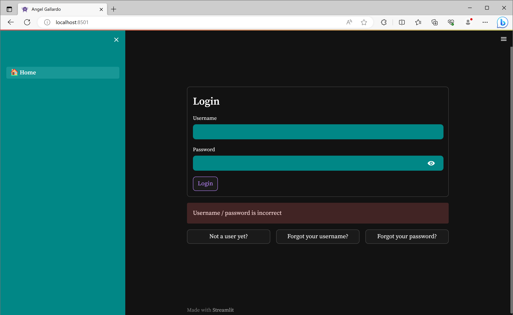

# Chat GPT clone using 🦜️LangChain and Streamlit

## Description:
A Web App that allows the users to use a Chat GPT clone. The application will work through token currency so the user needs to have tokens to be able to use it (to mimic a working app)
The web app allows the users to register, log in, retrive forgoten password or username, and change their password. After registering, the user will receive 10,000 tokens as gift to test the app.
All the information related to the web app is stored in a local SQLite DB.

The idea of this project was to put my new skills to use and try to create a complete solution from scratch. I know that this type of task is extremely complicated because of how many diffent things are involved, so to simplify the workload, I used two technologies [Streamlit](https://streamlit.io/) and [🦜️LangChain](https://www.langchain.com/)

Streamlit is a Python package that allows the user to create a Web App in seconds, and it is focused on the data visualization side. 

🦜️LangChain is a Python package designed to simplify the creation of a pipeline around any LLM.

This project welcomes it's user to the web app with a login widget. 

In the case that you are not registered, you can click the button which will take you to the registration page.

All of these widgets are done through the incredible package of [Streamlit-Authenticator](https://github.com/mkhorasani/Streamlit-Authenticator)

When a user cannot login (he no longer remembers its username/password) He can go to the forgot user/password page to retrieve it.

Here, the user will give some info to retrieve it's login information.

And the web app will send the information to the registered email.

Once the user has logged in succesfully, he will be able to use the app. 
On the sidebar he has the options to Logout and Reset Password.
It also shows the token balance so you can always know how many inquiries you can do.

All the conversation is shown in a chat style and the LLM is capable of answering each question using the previous questions as reference to remove the need of creating context each time.
The LLM used is Chat GPT 4 of [OpenAI](https://openai.com/) which is one of the cutting edge LLM in the industry.

### To run:
1. Install all the dependencies by: `pip install -r requirements.txt`
2. Save your OPEN AI API key to your environment variables
3. Host the Web App in your local network by:  `streamlit run .\🏠_Home.py`

### Debugging:
If you find any bugs or have any doubts, do not hesitate to contact me via <gallardotabares14@gmail.com>

### The future steps of this project are:
- Integrate a payment solution like Stripe to make it a complete MVP
- Test it with public to know if they find it useful and get their opinion on areas of improvement